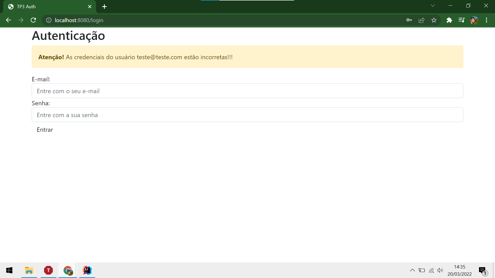
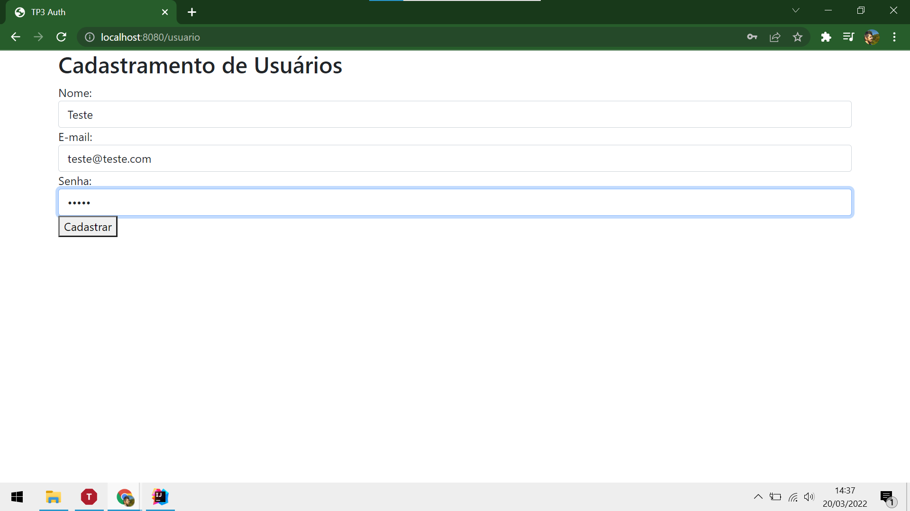
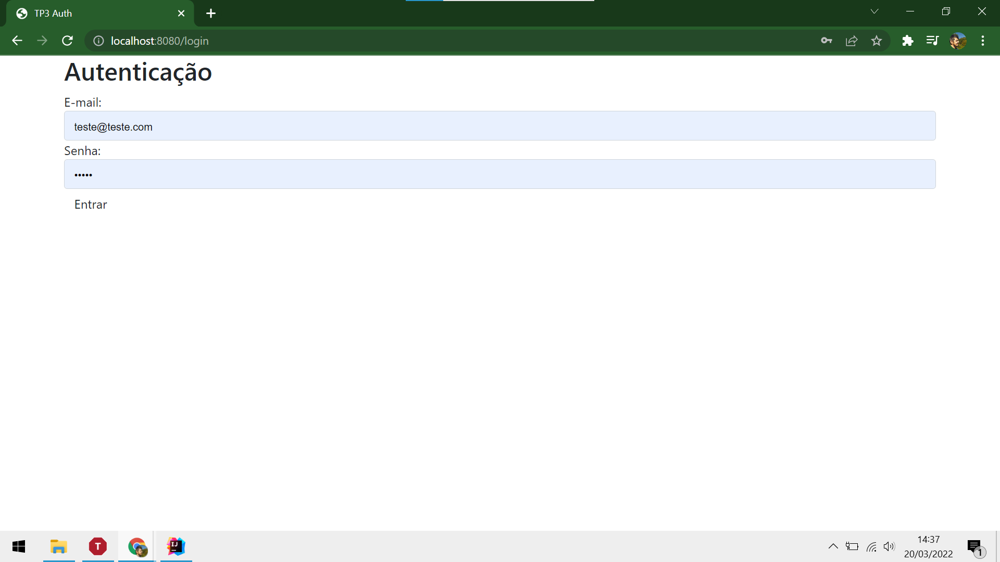

# Desenvolvimento Web com Java EE

### Teste de Perfomance 3

* Desenvolver a autenticação de usuários em sistemas Java Web
* Desenvolver a autorização de usuários em sistemas Java Web
* Mapear classes java como entidades
* Estabelecer relacionamentos entre as entidades
Você deve construir uma aplicação Java Web dividida em três camadas, modelo, visão e controle, utilizando Spring Web MVC para construí-la, e JSP para a interface com o usuário, para o cadastro e autenticação de um usuário de um sistema web. 
* Este usuário terá, neste momento, os seguintes campos de formulário:

  * Nome
  * E-mail
  * Senha

O formulário deve possuir um botão Salvar. Quando o botão Salvar for acionado, sua aplicação deve gravar estas informações em banco de dados. Para tal, sua classe Usuario deve ser modelada como uma entidade, usando a API de persistência Java. A seguir, a aplicação deve exibir as informações de nome e e-mail do usuário numa página JSP de mensagem de sucesso no cadastro, bem como um link Login.

Quando a opção de Login for selecionada, a aplicação deve exibir um formulário solicitando e-mail e senha do usuário, com um botão Realizar Login. A ação Realizar Login deve buscar o e-mail informado na base de dados e, caso ele exista, comparar a senha informada com a senha registrada.

Home

Tetando acessar com as credenciais erradas

Cadastrando usuário teste

Autenticando com usuário teste

Usuário logado

